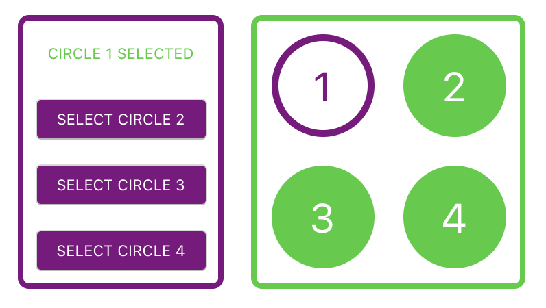

## Circle Selector

### Date: 4/20/2020

#### By: Michael Lackey
#### [Website](https://michaellackey.com/) | [GitHub](https://github.com/mlackey9601) | [LinkedIn](https://www.linkedin.com/in/michaelglackey/) | [Vettery](https://www.vettery.com/ga/employers)
***

### ***Description***

##### A VERY basic app to showcase a fundamental knowledge of React components.  Completed in less than 30 minutes.
***

### ***Technologies Used***

* HTML5
* CSS3
* JavaScript
* NodeJS
* ReactJS
***

### ***Getting Started***

##### Click on the selector and watch as the corresponding circle is selected.
##### The project was deployed to GitHub pages and can be viewed [here](https://mlackey9601.github.io/circleSelector/).
***

### ***Screenshots***

###### Circle Selector
 
***
